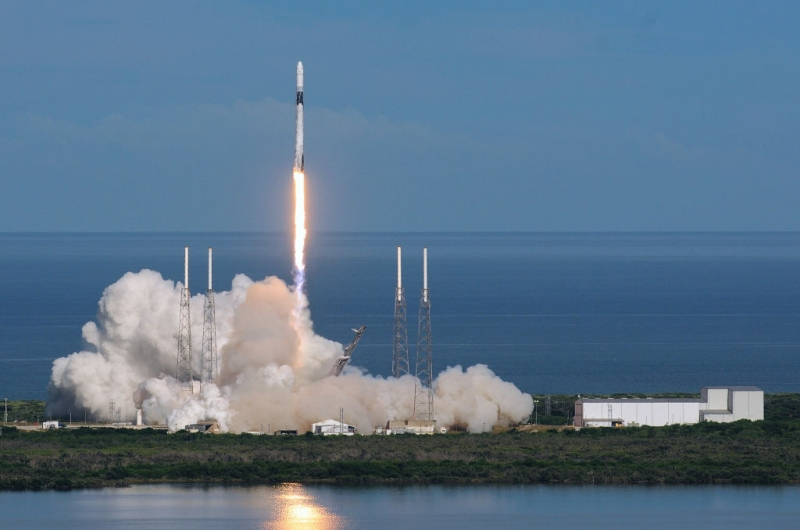

# spaceTechAnalysis

## ASSIGNMENT IN PROGRESS!!

A class to (assigment in progress)... Created for Professional Portfolio Project: Assignment 18: Angela Yu 100 Days of Code -- "Data Science: Analyse and Visualise the Space Race".

This project is...

### Resources Utilized

-   [Python](https://www.python.org/)

_MIT License: Copyright (c) 2024- Andrew Blais_

---

### Future Updates

-   Lorem...

---

### Documentation:

```requirements
lorem_ipsum>=1.0T
```

_Docstrings for `main.py`:_

```

```

---

## Created in completing an assignment for Angela Yu Course 100 Days of Code: The Complete Python Pro Bootcamp.

### **Day 99, Professional Portfolio Project [Data Science]**

#### **_Assignment 18: "Analyse and Visualise the Space Race"_**

Use space mission data from 1957 onwards to analyse and visualise trends over time.

### **Assignment instructions:**

You've learnt about all the core aspects of data exploration, data cleaning, and data visualisation.

Download, unzip and open the notebook I've included for this assignment.

You'll find an incredibly rich dataset from [nextspaceflight.com](nextspaceflight.com) that includes all the space missions since the beginning of Space Race between the USA and the Soviet Union in 1957!

It has data on the mission status (success/failure), the cost of the mission, the number of launches per country, and much much more.

There's so much we can learn from this dataset about the dominant organisations and the trends over time.

For example:

-   Who launched the most missions in any given year?

-   How has the cost of a space mission varied over time?

-   Which months are the most popular for launches?

-   Have space missions gotten safer or has the chance of failure remained unchanged?

I'm sure that you'll discover many more questions that you can formulate and answer with this dataset!

Use it to practice what you learnt about creating various types of charts and visualisations, from choropleths to sunburst charts to segmented bar charts and see if you can turn data into insight.

Good luck!



---

### My Submission:

My project is viewable here: https://github.com/andrewblais/spaceTechAnalysis

---

### **Questions for this assignment**

#### _Reflection Time:_

**_Write down how you approached the project._**

Lorem ipsum...

**_What was hard?_**

Lorem ipsum...

**_What was easy?_**

Lorem ipsum...

**_How might you improve for the next project?_**

Lorem ipsum...

**_What was your biggest learning from today?_**

Lorem ipsum...

**_What would you do differently if you were to tackle this project again?_**

Lorem ipsum...
